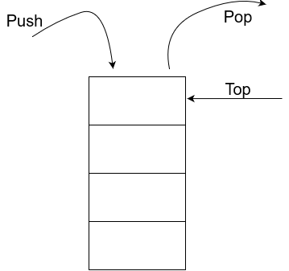

# Mündəricat
1. [Qısa izah](#qisa-izah)
    1. [class Node](#class-node)
    2. [class CustomStack](#class-customstack)
2. [Proqramın işə salınması](#proqramın-işə-salınması)
3. [Nəticə](#nəticə)
    1. [Giriş verilənləri](#giriş-verilənləri)
    2. [Alınan nəticə](#alınan-nəticə)

# Custom Stack

Bildiyimiz kimi Stack LIFO (Last in First out) məntiqi ilə işləyir.

<p align="center">
  
</p>

## Qısa izah

İlk öncə integer max uzunluğuna sahib Array yaradıb onun üzərində işləməyi düşünürdüm. Lakin bu memory allocation baxımından əlverişsiz olacağı üçün Linked List məntiqindən istifadə etmək qərarına gəldim.

### class Node

İlk öncə Linked list Node class-ı yaratdım. Bu class həm başdakı elementi götürməyə, həm də növbəti elementə reference verməyə kömək olur.

### class CustomStack

Bu class bizim proqramımızın əsas funksiyalarını saxlayır.

1. Count (property) - Stack-in uzunluğunu göstərir.
2. Push (method) - Stack-in əvvəlinə element əlavə edir.
3. Pop (method) - Stack-in əvvəlindəki elementi silir.
4. Peek (method) - Stack-in əvvəlindəki elementi göstərir.
5. display (method) - Bu method built-in olaraq stack daxilində gəlmir. Bu koddakı əsas missiyası stack-in bütün elemntlərini çap etməkdir.

## Proqramın işə salınması

```bash
dotnet run
```

## Nəticə

### Giriş verilənləri

```csharp
        st.Push(1);
        st.Push(2);
        st.Push(3);
        st.Push(4);
        st.Push(5);
        st.Peek();
        st.Count;
        st.Pop();
        st.Pop();
        st.Peek();
        st.Count;
```

### Alınan nəticə

```bash
5, 4, 3, 2, 1
Basdakı element: 5
Stack-in uzunlugu: 5
---------------------
3, 2, 1
Basdakı element: 3
Stack-in uzunlugu: 3
```
